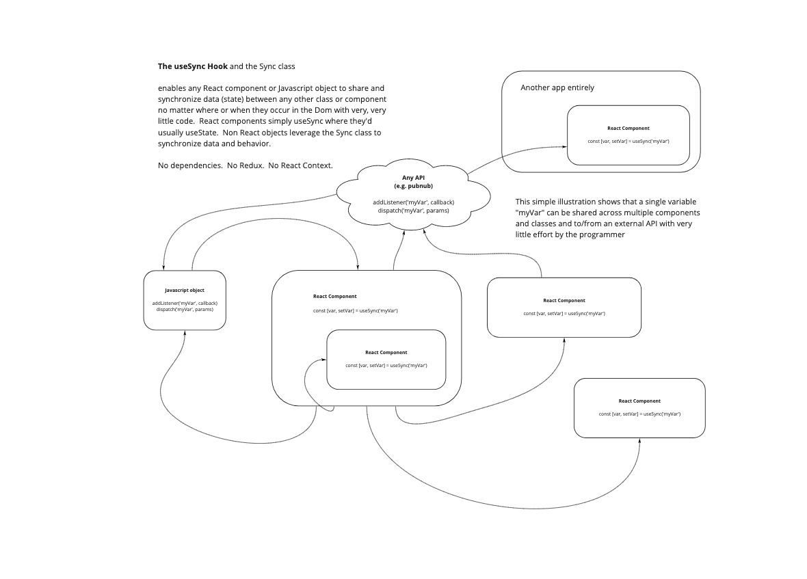

# Sync.js

This is an agnostic javascript library that synchronizes shared data/state throughout your app.  It is tiny, unopinionated and can interface with and/or replace Redux.  It can easily be extended to coordinate with an API or something like firebase or pubnub.  It is optimized for high performance and low foot print and has zero dependencies.

You can use sync with or without React, Redux, or any other framework.

## useSync - React

Is used just like useState except now you can have different React components anywhere in the app or dom that share the same values (sync) without depending on Redux or Context, nor do the components have to be running concurrently to stay syncrhonized.

See the [demo](https://chadsteele.github.io/sync/)

usage:

```javascript
    import {useSync} from 'sync.js'

    const [myVar, setVar] = useSync('myVar','optional initial value')
```



#NPM
It's called ez-sync-js
[https://www.npmjs.com/package/ez-sync-js](https://www.npmjs.com/package/ez-sync-js)
